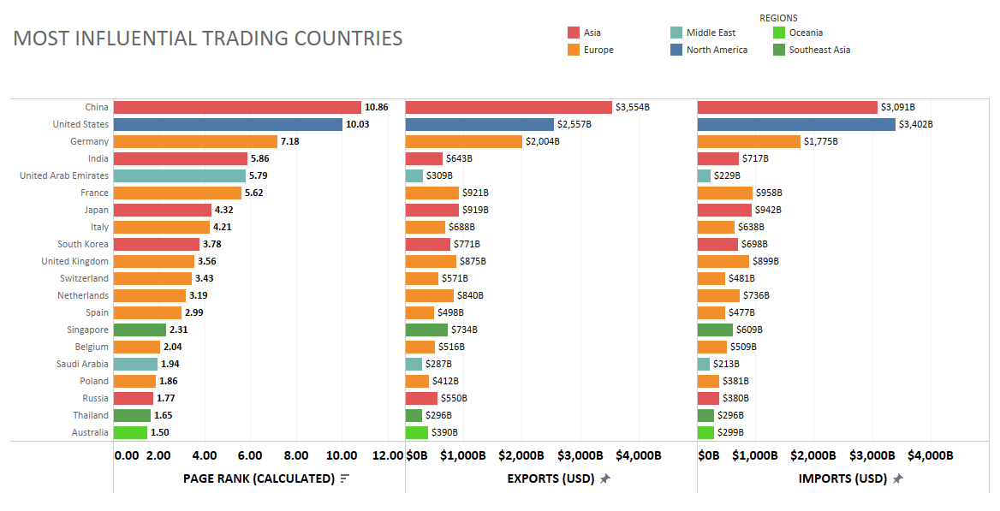
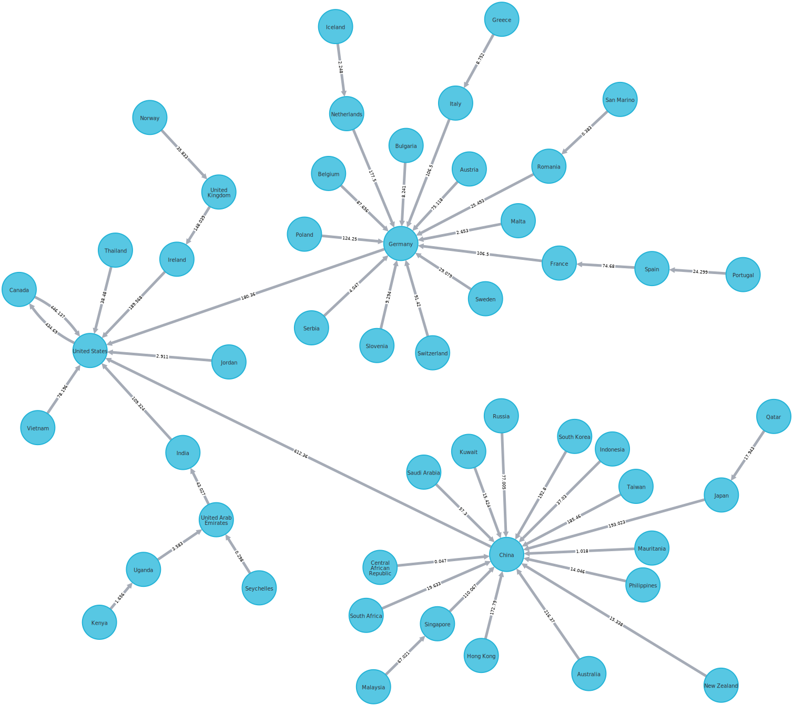
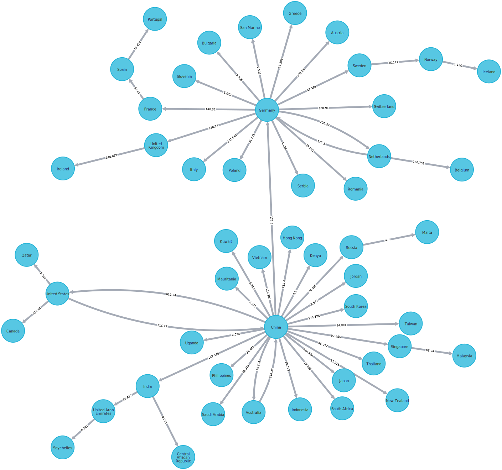

# graphdb_cia_factbook

## Description
Takes publicly available data from the CIA factbook (https://www.cia.gov/the-world-factbook/countries/) and downloads key tables into CSV's.  Those CSV's are than uploaded to Neo4j.  Where a graphDB Page Rank and Article Rank are computed.  CSV summary and raw tables will be exported to the output folder.

## How to run
1) Run: scrape_cia.py which will pull the data from the CIA Factbook.
2) Launch an instance of Neo4j.  I used Neo4j Desktop.  Create a new DB instance for this project.
    - By default the project will delete all existing nodes so make sure you don't have another instance running.
    - The tool uses cypher so theoretically any graphDB that supports Cypher could have the data uploaded.  The code to run Article and Page Rank are less likely to work.
3) Run: preprocess_upload_neo4j.py
    - If Neo4j is not located at the default location, ("localhost:7687"), rename the "url" variable.
    - Manually enter user name and password

## GraphDB
The data can be explored in the graph DB to gain further insights.

### Top 50 countries by PageRank and which country they export the most to.

### Top 50 countries by PageRank and which country they import the most from.

## Known issues 
* The amount of trade each country has is taken from a percentage of the total imports times the total imports for a given country.  These maybe done for different years depending upon the data.  The latest year is assumed.  And if conflicting data appears the highest trade route is assumed.  This results in some countries having more trade than the total trade for a given year.  Because it is a combination of many years.
* When the code was run in March much of the trade data was from 2020 and earlier.
* A number of naming inconsistencies exist in the source data.  I've attempted to clean up where possible.

## Files Generated:
* scrape_cia.py
  - output/exports.csv - Breakdown of total exports per year
  - output/exports_goods.csv - Top listed goods for exports
  - output/exports_partners.csv - List of countries a given country exported too
  - output/imports.csv - Breakdown of total imports per year
  - output/imports_goods.csv - Top listed goods for imports
  - output/imports_partners.csv - List of countries a given country imported from
  - output/gdp.csv - GDP for all countries
  - output/gdp_per_capita.csv - GDP per capita for all countries
  - output/real_gdp.csv - Real GDP for all countries
  - output/real_gdp_per_capita.csv - Real GDP per capita for all countries
  - output/population.csv - Population for all countries
  - output/regions.csv - Mapping of regions where countries are located
* preprocess_upload_neo4j.py
  - output/article_page_rank_countries.csv - Summary table for each country including pageRank
  - output/trade_partners.csv - The table that was used to create edges for the graph DB.
* manually created
  - output/goods_grouping.csv - An attempt to group import and exports goods to larger categories
